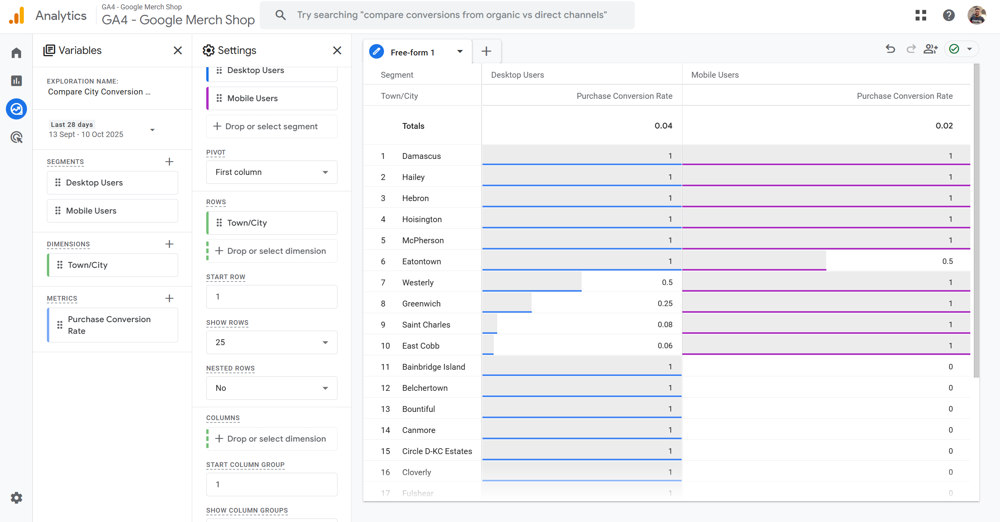
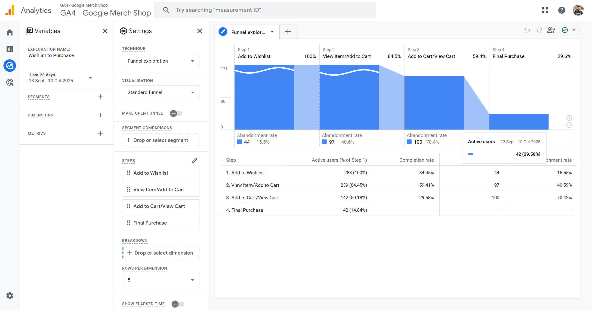
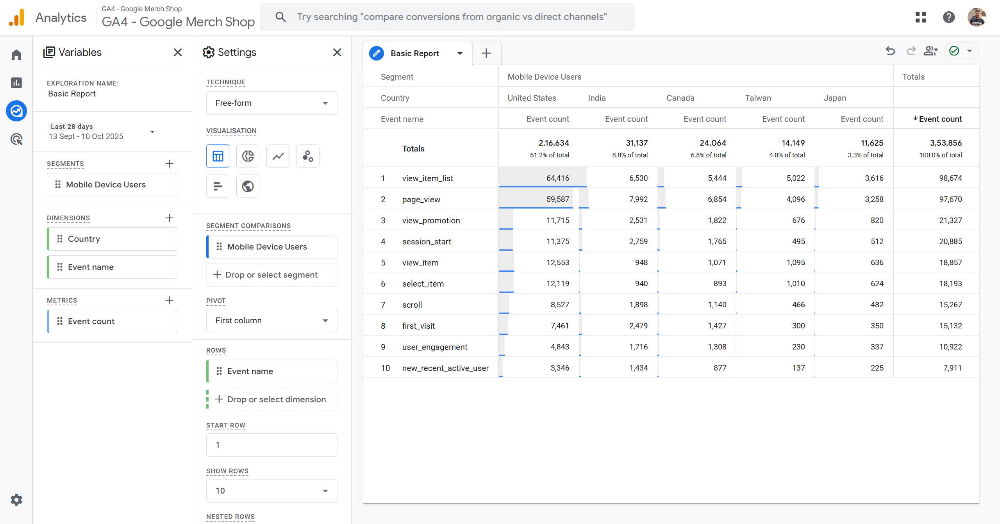
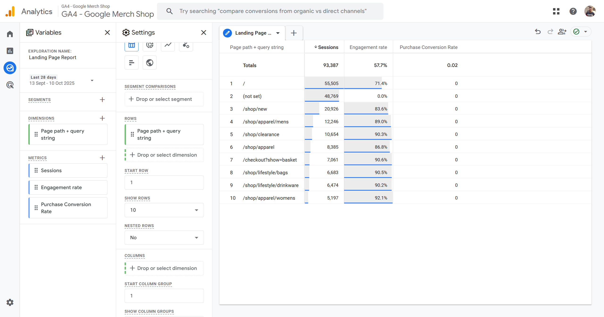
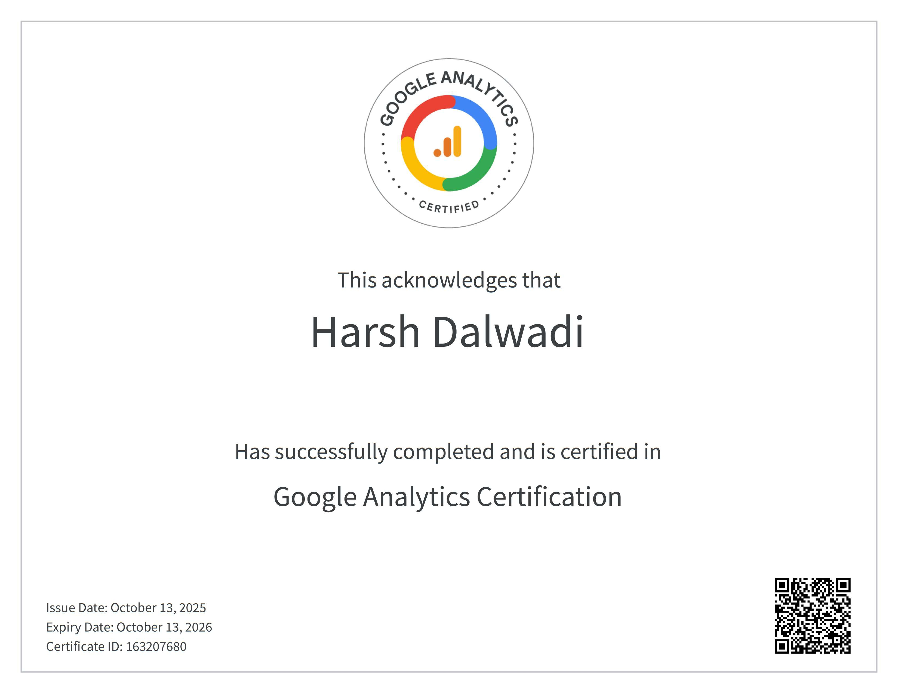

# Google Analytics 4 (GA4) - Learning Notes

These are my personal notes taken while studying for and passing the Google Analytics 4 certification from Google. They cover key concepts, reporting, KPIs, event types, and workflow features useful for analysis and exam preparation.

---

## Certification

I recently completed the official **Google Analytics 4 Certification** from Google. (My certificate file is also included in the repo.)

---

## Table of Contents

- Introduction
- Report Understanding
- Acquisition Reports
- KPIs, Bounce Rate & Retention
- Events, Dimensions & Metrics
- Custom Reporting & Internal Traffic
- Funnels & Debugging
- Exploration Reports & GA4 vs GTM

---

## Introduction

- All data sent to Google Analytics comes in the form of **Events**.
- GA4 combines data streams from Android, web, and iOS platforms.
- GA4 offers more user-centered reports and captures more data than Universal Analytics.
- Google Tag Manager (GTM) is used to manage tags and event tracking efficiently.

---

## Report Understanding

### Main report categories:

1. **Acquisition:** Shows where users come from (e.g., direct, referral, link).
2. **Retention:** Tracks new users and returning users on your website.
3. **Monetization:** Revenue and conversion analysis.

### Realtime Users

- Monitor real-time users minute-wise.
- View individual user "snapshots" to analyze specific user sessions within time frames.

---

## Acquisition Reports

- **User Acquisition:**
  - Tracks new users by first medium.
  - "Engaged sessions" track user visits and the time spent on the site.
  - Helps understand how much time users spend.
  - You can filter first-time user acquisition by geography, time, event, and more.

- **Traffic Acquisition:**
  - Measures session activity to determine user engagement ratios.

- **Engagement:**
  - Actions users take on your site after arrival such as page views, button clicks, scrolling.
  - All these count as "events" (you can even create your own custom events).
  - Reports can be customized based on these events.

---

## KPIs, Bounce Rate & Retention

- **Conversion/Goal:**  
  Any event counted as a success (e.g., file downloads, button clicks, signup, etc.).

- **Pages & Screens:**  
  Which pages/screens drive most conversions?

- **Bounce Rate:**  
  Percentage of users who leave without interaction.  
  Helps diagnose poor fit, loading issues, or confusing content.  
  `Bounce rate = 100 - Engagement rate`

- **Retention Overview:**  
  Displays counts of new and returning users, broken down by cohorts (groups of users over time).

- **User Attributes & Tech:**  
  Segment users by geography, device type (phone, browser), etc.

---

## Events, Dimensions & Metrics

- Four main event categories:
  1. Automatically collected (default)
  2. Enhanced measurement events (enabled by toggle)
  3. Recommended events (as per GA4 best practices)
  4. Custom events (you create these yourself)

- You can create or modify events via:
  `Admin > Data Streams > Modify`

- Dimensions = qualitative attributes (e.g., city, age group, page title).  
- Metrics = quantitative values (e.g., click-through rate, number of sessions).

---

## Custom Reporting & Internal Traffic

- **Segments:** Filter to focus reports on specific groups of sessions/users/events.  
  E.g., mobile users clicking in North America.

- **Exclude Internal Traffic:**  
  Developers or team members testing can skew data — exclude using IP filters in Admin > Data Stream.

- **Landing Page Report:**  
  Identifies pages where users enter your site directly.

---

## Funnels & Debugging

- **Funnel Exploration:** Visualize user drop-off across defined steps (signup flow, etc.).  
  - Closed funnel: Users must start from first step and go sequentially.  
  - Open funnel: Users can enter from any step.

- **Debug View:**  
  Real-time event data from devices/browsers in debug mode.  
  Enable via GTM, GA4 Admin panel, or Chrome extension “Google Analytics Debugger.”

---

## Explorations & GA4 vs GTM

- **Path Exploration:** Shows actual user navigation through site/app pages and events.  
- **Segment Overlap:** Shows how different user segments overlap.  
- **Cohort Exploration:** Tracks groups performing similar events over time.  

- **Difference:**  
  GA4 provides reporting and analysis.  
  GTM is the tool that fires tracking codes sending data to GA4.

---

## Example Freeform Reports

During study, I practiced by building reports in GA4. Screenshots attached below for reference (see repo images):

### 1. Compare City Conversion Performance by Desktop vs. Mobile

Shows Purchase Conversion Rates by Town/City split across Desktop vs Mobile users.

---

### 2. Funnel Exploration: Wishlist to Purchase

Tracks how users drop off or continue:  
- Add to Wishlist  
- View/Add to Cart  
- View Cart  
- Final Purchase  
Shows abandonment rates in purchase funnel.

---

### 3. Basic Event Report by Country

Quick comparison of event count for Mobile Device Users by Country (United States, India, Canada, etc), including events like page_view, session_start, scroll, etc.

---

### 4. Landing Page Report

Shows page path, engagement rate, and purchase conversion rate for landing pages, helps analyze where traffic enters the site and conversion potential.

---
### Google Analytics 4 Certification

